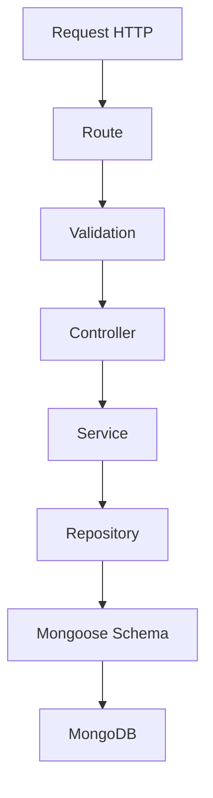
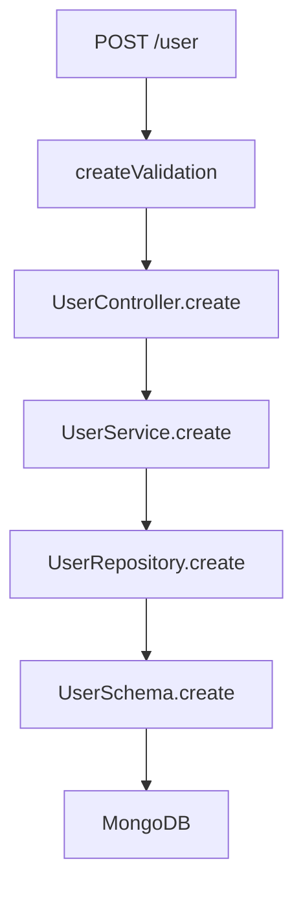

<div align="center">

# Arquitetura Node.js com TypeScript

API de exemplo construída com **Node.js**, **TypeScript**, **Express** e **MongoDB**, demonstrando uma arquitetura backend organizada em camadas, com separação de responsabilidades entre rotas, validações, controllers, services, repositories e schemas.


</div>

---

## Sobre o projeto

Este repositório é um estudo prático de **arquitetura backend com Node.js e TypeScript**, utilizando uma estrutura em camadas para organizar melhor as responsabilidades da aplicação.

A proposta é demonstrar uma base simples, porém bem estruturada, para criação de APIs com:

* Separação entre rota, validação, controller, service e repository
* Validação de entrada com Zod
* Persistência de dados com MongoDB e Mongoose
* Configuração de ambiente com dotenv
* Padronização de código com ESLint e Prettier
* Padronização de commits com Husky e Commitlint

O foco do projeto não é a complexidade da regra de negócio, mas sim a **organização do código**, a **clareza da arquitetura** e a criação de uma base evolutiva para APIs Node.js.

---

## Objetivo

Demonstrar como estruturar uma API Node.js com TypeScript de forma organizada, separando responsabilidades e evitando que regras de negócio, acesso a dados e detalhes HTTP fiquem misturados na mesma camada.

Este projeto pode servir como base de estudo para conceitos como:

* Arquitetura em camadas
* Repository Pattern
* Service Layer
* Validação de dados
* Persistência com MongoDB
* Boas práticas de organização em projetos backend
* Padronização de desenvolvimento

---

## Arquitetura da aplicação

O fluxo principal da aplicação segue a seguinte estrutura:



### Responsabilidade de cada camada

| Camada        | Responsabilidade                                                        |
| ------------- | ----------------------------------------------------------------------- |
| `routes`      | Define os endpoints HTTP da aplicação                                   |
| `validations` | Valida os dados recebidos na requisição                                 |
| `controller`  | Recebe a requisição, chama a regra de negócio e retorna a resposta HTTP |
| `service`     | Centraliza a regra de negócio da aplicação                              |
| `repository`  | Isola o acesso ao banco de dados                                        |
| `schema`      | Define o modelo de dados utilizado pelo Mongoose                        |
| `infra`       | Concentra configurações externas, como conexão com banco de dados       |

---

## Estrutura do projeto

```text
src
├── app
│   ├── controller
│   │   └── UserController.ts
│   ├── interfaces
│   │   └── IUser.ts
│   ├── repository
│   │   └── UserRepository.ts
│   ├── schema
│   │   └── UserSchema.ts
│   ├── service
│   │   └── UserService.ts
│   └── validations
│       └── user
│           └── create.ts
├── infra
│   └── database
│       └── mongo
│           └── index.ts
├── routes
│   ├── index.router.ts
│   └── user.router.ts
├── app.ts
└── server.ts
```

---

## Stack utilizada

### Backend

* Node.js
* TypeScript
* Express
* MongoDB
* Mongoose

### Validação e configuração

* Zod
* dotenv
* cors

### Qualidade de código

* ESLint
* Prettier
* Husky
* Commitlint

### Desenvolvimento

* Suporte nativo a TypeScript do Node.js 24 (type stripping), sem `typescript`, `ts-node` ou `nodemon`
* `node --watch` para reiniciar a aplicação automaticamente em desenvolvimento

---

## Conceitos demonstrados

### Arquitetura em camadas

O projeto separa responsabilidades em camadas específicas, evitando que a aplicação concentre regras de negócio, validações e acesso a dados no mesmo arquivo.

### Repository Pattern

A camada de repository isola a persistência de dados, permitindo que a aplicação não dependa diretamente dos detalhes do Mongoose dentro das regras de negócio.

### Service Layer

A camada de service centraliza a lógica da aplicação, facilitando manutenção, testes e evolução futura.

### Validação de entrada

Antes de chegar ao controller, os dados da requisição passam por uma camada de validação utilizando Zod.

### Persistência com MongoDB

O projeto utiliza Mongoose para modelagem e persistência dos dados no MongoDB.

---

## Pré-requisitos

Antes de executar o projeto, você precisa ter instalado:

* Node.js `24.x` (versão definida em `.nvmrc` e em `engines` no `package.json`)
* npm
* MongoDB local ou uma instância MongoDB remota

> Se você utiliza [nvm](https://github.com/nvm-sh/nvm), basta rodar `nvm use` na raiz do projeto para selecionar a versão correta do Node.js.

---

## Como executar o projeto

### 1. Clone o repositório

```bash
git clone https://github.com/Felps03/arquitetura-node-typescript.git
```

### 2. Acesse a pasta do projeto

```bash
cd arquitetura-node-typescript
```

### 3. Instale as dependências

```bash
npm install
```

### 4. Configure as variáveis de ambiente

Crie um arquivo `.env` na raiz do projeto:

```env
PORT=3000
TARGET=local
MONGO_DB_URL=mongodb://localhost:27017/arquitetura-node-typescript
```

### 5. Execute em modo desenvolvimento

```bash
npm run dev
```

A aplicação será iniciada em:

```text
http://localhost:3000
```

---

## Variáveis de ambiente

| Variável       | Obrigatória | Descrição                             | Valor sugerido                                          |
| -------------- | ----------- | ------------------------------------- | ------------------------------------------------------- |
| `PORT`         | Não         | Porta onde a aplicação será executada | `3000`                                                  |
| `TARGET`       | Não         | Identificação do ambiente atual       | `local`                                                 |
| `MONGO_DB_URL` | Não         | URL de conexão com o MongoDB          | `mongodb://localhost:27017/arquitetura-node-typescript` |

Caso `MONGO_DB_URL` não seja informada, o projeto utiliza uma URL local padrão configurada no código.

---

## Scripts disponíveis

| Script            | Descrição                                                          |
| ----------------- | ------------------------------------------------------------------- |
| `npm run dev`     | Inicia a aplicação em modo desenvolvimento com `node --watch`       |
| `npm start`       | Inicia a aplicação em modo produção                                 |
| `npm run prepare` | Instala/configura os hooks do Husky                                 |

---

## Versão do Node.js

O projeto fixa a versão do Node.js em `24.x` através de:

* `.nvmrc` — usado por ferramentas como [nvm](https://github.com/nvm-sh/nvm) para selecionar automaticamente a versão correta
* `engines` no `package.json` — sinaliza a versão esperada para gerenciadores de pacote e ferramentas de CI/CD

---

## Execução nativa de TypeScript (sem `typescript`/`ts-node`)

A partir da versão 24, o Node.js executa arquivos `.ts` nativamente através de **type stripping**: as anotações de tipo são removidas em tempo de execução, sem checagem de tipos e sem etapa de build. Por isso o projeto não depende mais de `typescript`, `ts-node` ou `nodemon`:

* `npm run dev` → `node --watch ./src/server.ts`
* `npm start` → `node ./src/server.ts`

Pontos importantes dessa abordagem:

* O `tsconfig.json` foi removido, pois o Node.js ignora esse arquivo
* Os imports relativos precisam ser explícitos com a extensão `.ts` (ex.: `import App from './app.ts'`)
* Imports usados apenas como tipo devem usar `import type` (ex.: `import type { IUser } from '../interfaces/IUser.ts'`), já que o type stripping remove apenas o que é "erasable" — sintaxes como enums, namespaces com código em runtime, parâmetros de construtor com modificadores de acesso e decorators não são suportadas sem checagem/transpilação adicional

---

## Endpoints

### Criar usuário

```http
POST /user
```

Cria um novo usuário no MongoDB.

#### Body

```json
{
  "name": "Felipe Santos",
  "age": 32
}
```

#### Exemplo com curl

```bash
curl -X POST http://localhost:3000/user \
  -H "Content-Type: application/json" \
  -d '{
    "name": "Felipe Santos",
    "age": 32
  }'
```

#### Resposta esperada

```json
{
  "name": "Felipe Santos",
  "age": 32,
  "_id": "665f1c2e5a0f4c2a1f000000",
  "__v": 0
}
```

---

## Exemplo do fluxo de criação de usuário



---

## Organização das responsabilidades

### Route

Define o endpoint responsável por receber a requisição.

```ts
router.post('/user', createValidation, UserController.create);
```

### Validation

Valida o payload antes que ele chegue ao controller.

```ts
const schema = z.object({
  name: z.string(),
  age: z.number().optional(),
});
```

### Controller

Recebe os dados da requisição, chama o service e retorna a resposta HTTP.

### Service

Centraliza a regra de negócio da aplicação.

### Repository

Executa a operação de persistência no banco de dados.

### Schema

Define o formato do documento salvo no MongoDB.

---

## Ponto de atenção

Atualmente, o campo `age` é obrigatório no schema do Mongoose, mas não está marcado como obrigatório na validação com Zod.

Para manter consistência entre validação e persistência, uma melhoria recomendada seria ajustar a validação para:

```ts
const schema = z.object({
  name: z.string(),
  age: z.number(),
});
```

---

## Melhorias futuras

Algumas melhorias que podem evoluir este projeto:

* Adicionar testes unitários
* Adicionar testes de integração
* Criar um `docker-compose.yml` com MongoDB
* Adicionar arquivo `.env.example`
* Criar tratamento centralizado de erros
* Adicionar exceptions customizadas
* Melhorar tipagem dos controllers
* Adicionar Swagger/OpenAPI
* Criar pipeline de CI com GitHub Actions
* Adicionar camada de logs estruturados
* Implementar paginação e listagem de usuários
* Adicionar endpoint de busca por ID
* Adicionar endpoint de atualização de usuário
* Adicionar endpoint de remoção de usuário
* Separar interfaces de request e response
* Criar aliases de importação para reduzir caminhos relativos
* Adicionar Dockerfile para execução em container

---

## Possível evolução da arquitetura

Uma próxima evolução do projeto poderia seguir uma organização mais próxima de Clean Architecture:

```text
src
├── modules
│   └── users
│       ├── controllers
│       ├── dtos
│       ├── repositories
│       ├── services
│       ├── schemas
│       └── validations
├── shared
│   ├── infra
│   ├── errors
│   ├── middlewares
│   └── utils
└── server.ts
```

Essa estrutura facilitaria a evolução da aplicação quando novos módulos fossem adicionados.

---

## Sugestão de `.env.example`

```env
PORT=3000
TARGET=local
MONGO_DB_URL=mongodb://localhost:27017/arquitetura-node-typescript
```

---

## Sugestão de `docker-compose.yml`

Caso queira executar o MongoDB via Docker, um exemplo simples seria:

```yaml
version: '3.8'

services:
  mongodb:
    image: mongo:6
    container_name: arquitetura-node-typescript-mongo
    ports:
      - "27017:27017"
    volumes:
      - mongodb_data:/data/db

volumes:
  mongodb_data:
```

Após criar o arquivo, execute:

```bash
docker compose up -d
```

---

## Sugestão de descrição para o repositório

```text
API Node.js + TypeScript com arquitetura em camadas usando Express, MongoDB, Mongoose, Zod e Repository Pattern.
```

---

## Sugestão de topics

```text
nodejs
typescript
express
mongodb
mongoose
api
backend
architecture
repository-pattern
clean-code
zod
eslint
prettier
```

---

## Autor

Desenvolvido por [Felipe Santos](https://github.com/Felps03).

---

## Licença

Este projeto está sob a licença ISC.

</div>
