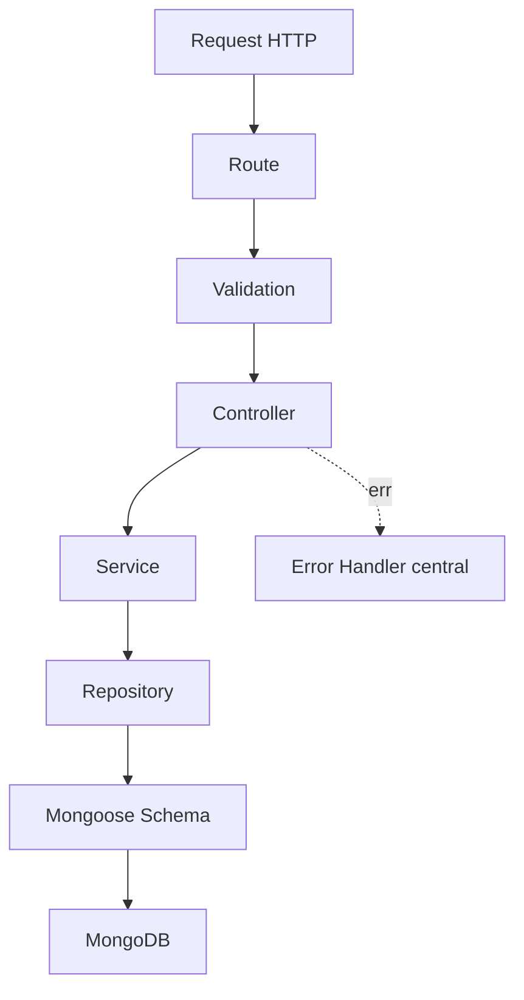
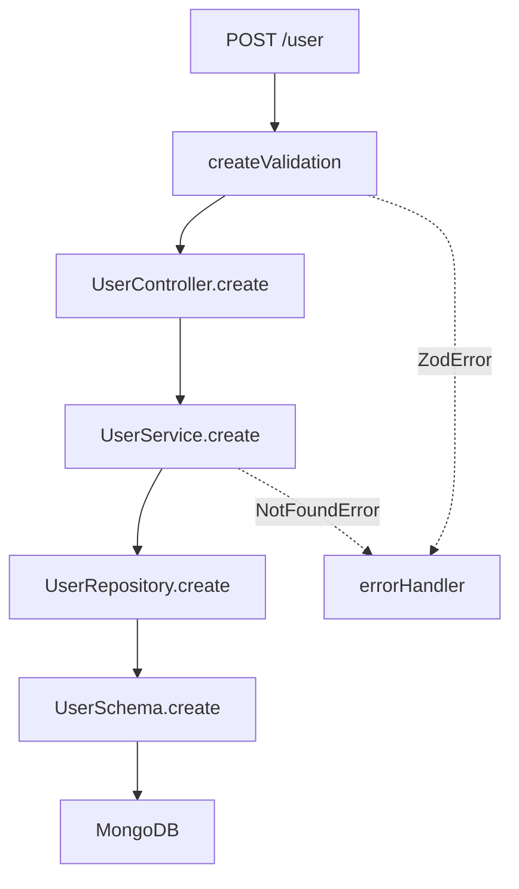
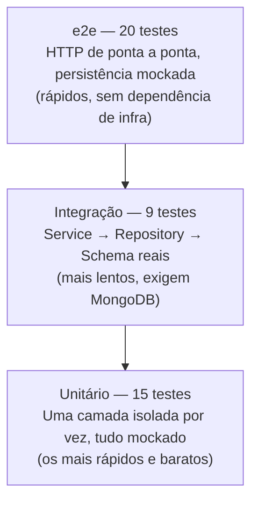

<div align="center">

# Arquitetura Node.js com TypeScript

API de exemplo construída com **Node.js**, **TypeScript nativo**, **Express** e **MongoDB**, demonstrando uma arquitetura backend organizada por **módulo de domínio**, com separação de responsabilidades entre rotas, validações, controllers, services, repositories e schemas dentro de cada módulo.


</div>

---

## Sumário

- [Sobre o projeto](#sobre-o-projeto)
- [Objetivo](#objetivo)
- [Arquitetura da aplicação](#arquitetura-da-aplicação)
- [Estrutura do projeto](#estrutura-do-projeto)
- [Stack utilizada](#stack-utilizada)
- [Conceitos demonstrados](#conceitos-demonstrados)
- [Pré-requisitos](#pré-requisitos)
- [Como executar o projeto](#como-executar-o-projeto)
- [Variáveis de ambiente](#variáveis-de-ambiente)
- [Scripts disponíveis](#scripts-disponíveis)
- [Aliases de importação](#aliases-de-importação)
- [Execução nativa de TypeScript](#execução-nativa-de-typescript-sem-typescriptts-node)
- [Endpoints](#endpoints)
- [Testes](#testes)
- [MongoDB e aplicação via Docker](#mongodb-e-aplicação-via-docker)
- [CI (GitHub Actions)](#ci-github-actions)
- [Ponto de atenção](#ponto-de-atenção)
- [Evolução da arquitetura](#evolução-da-arquitetura)

---

## Sobre o projeto

Este repositório é um estudo prático de **arquitetura backend com Node.js e TypeScript**, organizado por **módulo de domínio** (em vez de por camada técnica) para deixar mais claro o que pertence a cada parte da aplicação.

A proposta é demonstrar uma base simples, porém bem estruturada, para criação de APIs com:

- Separação entre rota, validação, controller, service e repository
- Validação de entrada com Zod (request, query e params)
- DTOs separando o contrato HTTP (request/response) do modelo de domínio/persistência
- Exceptions customizadas e tratamento centralizado de erros
- CRUD completo (criar, listar com paginação, buscar por id, atualizar e remover)
- Persistência de dados com MongoDB e Mongoose
- Logs estruturados em JSON
- Documentação da API via Swagger/OpenAPI, gerada a partir dos schemas Zod
- Testes unitários, de integração e e2e com o test runner nativo do Node.js
- Containerização com Docker e pipeline de CI no GitHub Actions

O foco do projeto não é a complexidade da regra de negócio, mas sim a **organização do código**, a **clareza da arquitetura** e a criação de uma base evolutiva para APIs Node.js.

---

## Objetivo

Demonstrar como estruturar uma API Node.js com TypeScript de forma organizada, separando responsabilidades e evitando que regras de negócio, acesso a dados e detalhes HTTP fiquem misturados na mesma camada.

Este projeto pode servir como base de estudo para conceitos como:

- Arquitetura em camadas
- Repository Pattern
- Service Layer
- DTOs e separação de request/response
- Tratamento centralizado de erros e exceptions customizadas
- Validação de dados
- Persistência com MongoDB
- Documentação de API com OpenAPI
- Testes automatizados (unitários, integração e e2e)
- CI/CD e containerização

---

## Arquitetura da aplicação

O fluxo principal da aplicação segue a seguinte estrutura:



### Responsabilidade de cada camada

| Camada         | Responsabilidade                                                          |
| -------------- | ------------------------------------------------------------------------- |
| `routes`       | Define os endpoints HTTP da aplicação e conecta os módulos                |
| `validations`  | Valida os dados recebidos na requisição (body, query e params) com Zod    |
| `controllers`  | Recebe a requisição, chama a regra de negócio e retorna a resposta HTTP   |
| `services`     | Centraliza a regra de negócio e mapeia documentos para DTOs de resposta   |
| `repositories` | Isola o acesso ao banco de dados                                          |
| `schemas`      | Define o modelo de dados utilizado pelo Mongoose                          |
| `dtos`         | Contratos de request/response da camada HTTP                              |
| `shared`       | Código transversal: infra, exceptions, error handler, logger, middlewares |
| `docs`         | Geração da documentação OpenAPI a partir dos schemas Zod                  |

O projeto é organizado por **módulo de domínio** (`modules/users`), e não por camada técnica: cada módulo concentra as suas próprias camadas (`controllers`, `services`, `repositories`, `schemas`, `validations`, `dtos`). Código verdadeiramente transversal (infraestrutura, exceptions, middlewares, logger) fica em `shared/`; a "casca" HTTP que conecta os módulos (`app.ts`, `server.ts`, `routes`, `docs`) fica no topo de `src/`.

---

## Estrutura do projeto

```text
src
├── modules
│   └── users
│       ├── controllers
│       │   └── UserController.ts
│       ├── dtos
│       │   ├── CreateUserRequest.ts
│       │   ├── UpdateUserRequest.ts
│       │   ├── UserResponse.ts
│       │   └── PaginatedResponse.ts
│       ├── repositories
│       │   └── UserRepository.ts
│       ├── schemas
│       │   ├── IUser.ts
│       │   └── UserSchema.ts
│       ├── services
│       │   └── UserService.ts
│       └── validations
│           ├── create.ts
│           ├── idParam.ts
│           ├── list.ts
│           └── update.ts
├── docs
│   ├── registry.ts
│   └── openapi.ts
├── routes
│   ├── index.router.ts
│   └── user.router.ts
├── shared
│   ├── errors
│   │   ├── AppError.ts
│   │   └── NotFoundError.ts
│   ├── infra
│   │   └── database
│   │       └── mongo
│   │           └── index.ts
│   ├── logger
│   │   └── index.ts
│   └── middlewares
│       ├── errorHandler.ts
│       └── requestLogger.ts
├── app.ts
└── server.ts

test
├── unit
│   ├── UserService.unit.test.ts
│   ├── errorHandler.unit.test.ts
│   └── schemas.unit.test.ts
├── integration
│   └── UserService.integration.test.ts
└── e2e
    └── app.e2e.test.ts
```

Os três tipos de teste ficam centralizados fora de `src/`: unitários em `test/unit/`, integração em `test/integration/` e e2e em `test/e2e/`.

---

## Stack utilizada

### Backend

- Node.js 24 (execução nativa de TypeScript)
- Express 5
- MongoDB
- Mongoose 9

### Validação, contratos e documentação

- Zod
- `@asteasolutions/zod-to-openapi` + `swagger-ui-express` (Swagger/OpenAPI gerado a partir dos schemas Zod)
- cors

### Qualidade e padronização

- Prettier
- Husky
- Commitlint

### Desenvolvimento e operação

- Suporte nativo a TypeScript do Node.js 24 (type stripping), sem `typescript`, `ts-node` ou `nodemon`
- `node --watch` para reiniciar a aplicação automaticamente em desenvolvimento
- Aliases de import nativos (`#modules/*`, `#routes/*`, `#shared/*`) via campo `imports` do `package.json`
- Docker e Docker Compose (MongoDB + aplicação)
- CI no GitHub Actions

---

## Conceitos demonstrados

### Arquitetura modular por domínio

Dentro de cada módulo (ex.: `modules/users`), o projeto separa responsabilidades em camadas específicas (`controllers`, `services`, `repositories`, `schemas`, `validations`, `dtos`), evitando que a aplicação concentre regras de negócio, validações e acesso a dados no mesmo arquivo — e mantendo cada módulo de domínio coeso e fácil de localizar.

### Repository Pattern

A camada de repository isola a persistência de dados, permitindo que a aplicação não dependa diretamente dos detalhes do Mongoose dentro das regras de negócio.

### Service Layer

A camada de service centraliza a lógica da aplicação e mapeia os documentos do Mongoose para os DTOs de resposta (`#modules/users/dtos/UserResponse.ts`), evitando que detalhes de persistência "vazem" para a camada HTTP.

### DTOs de request/response

Os tipos usados na borda HTTP (`CreateUserRequest`, `UpdateUserRequest`, `UserResponse`, `PaginatedResponse`) são derivados dos próprios schemas Zod (`z.infer`) ou definidos explicitamente, mantendo uma única fonte de verdade entre validação, tipagem e documentação.

### Exceptions customizadas e tratamento centralizado de erros

Erros de domínio são modelados como subclasses de `AppError` (hoje, `NotFoundError`; novas subclasses podem ser adicionadas conforme o domínio crescer). Controllers não precisam de `try/catch`: como o projeto usa Express 5, erros lançados (ou rejeições de promises) em handlers `async` são automaticamente repassados para o middleware de erro central (`src/shared/middlewares/errorHandler.ts`), responsável por formatar a resposta de acordo com o tipo do erro (`ZodError`, `CastError`/`ValidationError` do Mongoose, `AppError` ou erro genérico).

### Logs estruturados

`src/shared/logger` emite logs em JSON (`timestamp`, `level`, `message` e metadados extras), sem dependências externas. Um middleware (`requestLogger`) registra método, rota, status e duração de cada requisição.

### Validação de entrada

Antes de chegar ao controller, os dados da requisição (body, query e params) passam por uma camada de validação utilizando Zod. Em caso de erro, o `ZodError` é repassado ao error handler central via `next(error)`.

### Persistência com MongoDB

O projeto utiliza Mongoose para modelagem e persistência dos dados no MongoDB. O `UserSchema` usa `{ timestamps: true }` (gera `createdAt`/`updatedAt` automaticamente) e a listagem paginada ordena por `createdAt` para garantir resultados determinísticos entre páginas.

### Documentação da API

A especificação OpenAPI é gerada a partir dos mesmos schemas Zod usados na validação (`src/docs/registry.ts`), evitando duplicar a definição dos contratos. É servida tanto via Swagger UI (`/docs`) quanto como JSON puro (`/docs/openapi.json`, útil para gerar clientes ou outras ferramentas).

### Graceful shutdown

`server.ts` trata `SIGTERM`/`SIGINT` fechando o servidor HTTP e a conexão com o MongoDB antes de finalizar o processo — importante para containers, que enviam `SIGTERM` ao parar/reiniciar um serviço.

---

## Pré-requisitos

Antes de executar o projeto, você precisa ter instalado:

- Node.js `24.x` (versão definida em `.nvmrc` e em `engines` no `package.json`)
- npm
- MongoDB local ou uma instância MongoDB remota (ou Docker, veja [MongoDB via Docker](#mongodb-e-aplicação-via-docker))

> Se você utiliza [nvm](https://github.com/nvm-sh/nvm), basta rodar `nvm use` na raiz do projeto para selecionar a versão correta do Node.js.

---

## Como executar o projeto

### 1. Clone o repositório

```bash
git clone https://github.com/Felps03/arquitetura-node-typescript.git
```

### 2. Acesse a pasta do projeto

```bash
cd arquitetura-node-typescript
```

### 3. Instale as dependências

```bash
npm install
```

### 4. Configure as variáveis de ambiente

Copie o arquivo `.env.example` para `.env` e ajuste os valores se necessário:

```bash
cp .env.example .env
```

### 5. Suba o MongoDB (caso não tenha uma instância própria)

```bash
docker compose up -d mongodb
```

### 6. Execute em modo desenvolvimento

```bash
npm run dev
```

A aplicação será iniciada em:

```text
http://localhost:3000
```

A documentação interativa (Swagger UI) fica disponível em `http://localhost:3000/docs`.

---

## Variáveis de ambiente

| Variável       | Obrigatória | Descrição                             | Valor sugerido                                          |
| -------------- | ----------- | ------------------------------------- | ------------------------------------------------------- |
| `PORT`         | Não         | Porta onde a aplicação será executada | `3000`                                                  |
| `TARGET`       | Não         | Identificação do ambiente atual       | `local`                                                 |
| `MONGO_DB_URL` | Não         | URL de conexão com o MongoDB          | `mongodb://localhost:27017/arquitetura-node-typescript` |

Caso `MONGO_DB_URL` não seja informada, o projeto utiliza uma URL local padrão configurada no código.

---

## Scripts disponíveis

| Script                     | Descrição                                                     |
| -------------------------- | ------------------------------------------------------------- |
| `npm run dev`              | Inicia a aplicação em modo desenvolvimento com `node --watch` |
| `npm start`                | Inicia a aplicação em modo produção                           |
| `npm test`                 | Executa toda a suíte de testes (unit + e2e + integration)     |
| `npm run test:unit`        | Executa apenas os testes unitários                            |
| `npm run test:e2e`         | Executa apenas os testes e2e (sobem a app real, sem MongoDB)  |
| `npm run test:integration` | Executa os testes de integração (requer MongoDB rodando)      |
| `npm run format`           | Formata o código com Prettier                                 |
| `npm run format:check`     | Verifica a formatação sem alterar arquivos (usado no CI)      |
| `npm run prepare`          | Instala/configura os hooks do Husky                           |

---

## Aliases de importação

O Node.js 24 resolve [subpath imports](https://nodejs.org/api/packages.html#subpath-imports) nativamente, sem bundler. O `package.json` define:

```json
"imports": {
  "#modules/*.ts": "./src/modules/*.ts",
  "#routes/*.ts": "./src/routes/*.ts",
  "#shared/*.ts": "./src/shared/*.ts"
}
```

Permitindo imports como `import UserService from '#modules/users/services/UserService.ts'` em código de outro módulo/camada, em vez de longas cadeias `../../`. Dentro do próprio módulo (ex.: um service importando seu repository) e entre arquivos irmãos, os imports continuam relativos normalmente (`../repositories/UserRepository.ts`, `./create.ts`).

---

## Execução nativa de TypeScript (sem `typescript`/`ts-node`)

A partir da versão 24, o Node.js executa arquivos `.ts` nativamente através de **type stripping**: as anotações de tipo são removidas em tempo de execução, sem checagem de tipos e sem etapa de build. Por isso o projeto não depende de `typescript`, `ts-node` ou `nodemon`:

- `npm run dev` → `node --watch ./src/server.ts`
- `npm start` → `node ./src/server.ts`

Pontos importantes dessa abordagem:

- O Node.js ignora o `tsconfig.json` em tempo de execução. O arquivo existe no repositório apenas como apoio ao editor (IntelliSense), com `"noEmit": true` — não há `tsc` nem etapa de build
- Os imports (relativos ou via alias) precisam ser explícitos com a extensão `.ts`
- Imports usados apenas como tipo devem usar `import type` (ex.: `import type { IUser } from './IUser.ts'`), já que o type stripping remove apenas o que é "erasable" — sintaxes como enums, namespaces com código em runtime, parâmetros de construtor com modificadores de acesso e decorators não são suportadas sem checagem/transpilação adicional
- Como não há `tsc`, também não há lint de sintaxe TypeScript no projeto: a padronização de código é feita apenas via Prettier

---

## Endpoints

Base path: `/user`. Documentação interativa completa em `/docs` (Swagger UI).

| Método   | Rota                 | Descrição                                         |
| -------- | -------------------- | ------------------------------------------------- |
| `GET`    | `/health`            | Health-check (não depende do MongoDB)             |
| `GET`    | `/docs`              | Swagger UI                                        |
| `GET`    | `/docs/openapi.json` | Especificação OpenAPI em JSON puro                |
| `POST`   | `/user`              | Cria um usuário                                   |
| `GET`    | `/user`              | Lista usuários paginados (mais recentes primeiro) |
| `GET`    | `/user/:id`          | Busca um usuário pelo id                          |
| `PATCH`  | `/user/:id`          | Atualiza parcialmente um usuário                  |
| `DELETE` | `/user/:id`          | Remove um usuário                                 |

### Criar usuário

```bash
curl -X POST http://localhost:3000/user \
  -H "Content-Type: application/json" \
  -d '{ "name": "Felipe Santos", "age": 32 }'
```

```json
{
  "_id": "665f1c2e5a0f4c2a1f000000",
  "name": "Felipe Santos",
  "age": 32,
  "__v": 0
}
```

### Listar usuários (paginado)

```bash
curl "http://localhost:3000/user?page=1&limit=10"
```

```json
{
  "data": [{ "_id": "665f1c2e5a0f4c2a1f000000", "name": "Felipe Santos", "age": 32, "__v": 0 }],
  "page": 1,
  "limit": 10,
  "total": 1
}
```

### Buscar por id

```bash
curl http://localhost:3000/user/665f1c2e5a0f4c2a1f000000
```

Retorna `404` com `{ "message": "User <id> not found" }` se o id não existir, ou `400` se o id não tiver um formato válido de ObjectId.

### Atualizar parcialmente

```bash
curl -X PATCH http://localhost:3000/user/665f1c2e5a0f4c2a1f000000 \
  -H "Content-Type: application/json" \
  -d '{ "age": 33 }'
```

### Remover

```bash
curl -X DELETE http://localhost:3000/user/665f1c2e5a0f4c2a1f000000
```

Retorna `204 No Content` em caso de sucesso.

### Erros de validação

Erros de validação — tanto do Zod (formato do payload) quanto do Mongoose (`min`/`max`/`minlength`/`maxlength` do schema, ex.: `age` fora do intervalo `0`–`120`) — são formatados no mesmo formato pelo error handler central:

```json
{
  "message": "Validation error",
  "issues": [
    {
      "code": "invalid_type",
      "path": ["name"],
      "message": "Invalid input: expected string, received undefined"
    }
  ]
}
```

---

## Exemplo do fluxo de criação de usuário



---

## Testes

O projeto usa exclusivamente o test runner nativo do Node.js (`node:test`), sem Jest ou Mocha, em três níveis:

| Tipo       | Onde fica                  | Convenção de nome       | O que cobre                                                       | Pré-requisito                  |
| ---------- | -------------------------- | ----------------------- | ----------------------------------------------------------------- | ------------------------------ |
| Unitário   | `test/unit/`               | `*.unit.test.ts`        | Uma camada isolada, com dependências mockadas via `t.mock.method` | Nenhum                         |
| Integração | `test/integration/`        | `*.integration.test.ts` | Service → Repository → Schema reais, contra um MongoDB real       | `docker compose up -d mongodb` |
| e2e        | `test/e2e/app.e2e.test.ts` | `*.e2e.test.ts`         | Aplicação Express real, HTTP de ponta a ponta via `fetch` nativo  | Nenhum (mocka a persistência)  |

### Pirâmide de testes



A pirâmide clássica tem a base (unitários) maior que o topo (e2e). Aqui o topo é o nível com mais testes — porque, neste projeto, os testes e2e mockam apenas a persistência (`UserSchema`) e sobem a aplicação real em memória, então custam quase tanto quanto um teste unitário, mas validam o contrato HTTP completo. Já os testes de integração, que exigem um MongoDB real, permanecem deliberadamente em menor número, cobrindo os comportamentos que só fazem sentido contra o banco de verdade (validação do Mongoose, ordenação da paginação, persistência real).

```bash
npm run test:unit
npm run test:integration   # requer MongoDB rodando
npm run test:e2e
npm test                   # roda tudo
```

Nos testes e2e, os métodos de persistência do `UserSchema` (`create`, `find`, `countDocuments`, `findById`, `findByIdAndUpdate`, `findByIdAndDelete`) são substituídos com `t.mock.method` (mock nativo do `node:test`) conforme o cenário, evitando a dependência de um MongoDB real — todas as demais camadas (rota, validação, controller, service, repository, error handler) são exercitadas de verdade. O arquivo `test/e2e/app.e2e.test.ts` cobre os 5 endpoints (`POST`, `GET` lista, `GET` por id, `PATCH`, `DELETE`), incluindo os cenários de sucesso, validação (`400`), recurso não encontrado (`404`) e falha de persistência (`500`).

A conexão com o MongoDB não é um efeito colateral do import de `app.ts`: é feita explicitamente em `server.ts` (`connectDatabase()`), o que permite importar a aplicação nos testes sem abrir uma conexão real com o banco.

Os testes de integração (`test/integration/UserService.integration.test.ts`) seguem o padrão **Given/When/Then** (em português, nos comentários e no nome do teste), exercitando `UserService` → `UserRepository` → `UserSchema` contra um MongoDB real — incluindo criação, busca, atualização, remoção, paginação ordenada e o erro de validação do Mongoose (`age` fora do intervalo permitido). A coleção é limpa antes de cada teste (`beforeEach`) para garantir isolamento entre os cenários.

### O que cada teste verifica

#### Unitários (`test/unit/`)

**`schemas.unit.test.ts`** — valida os schemas Zod isoladamente, sem subir a aplicação:

- `createUserSchema exige name e aceita age opcional` — `name` é obrigatório, `age` é opcional, e tipos errados são rejeitados.
- `updateUserSchema aceita payload parcial ou vazio` — qualquer subconjunto dos campos (ou nenhum) é válido, mas o tipo de cada campo continua sendo checado.
- `listUsersSchema aplica defaults e rejeita valores inválidos` — `page`/`limit` ausentes recebem os valores padrão (`1`/`10`); `limit` acima do máximo ou `page` negativo são rejeitados.
- `idParamSchema valida o formato de ObjectId do MongoDB` — aceita um ObjectId válido e rejeita qualquer string fora do formato.

**`UserService.unit.test.ts`** — testa a camada de service mockando `UserRepository` com `t.mock.method`, sem tocar no Mongoose:

- `UserService.create mapeia o documento criado para UserResponse` — o documento retornado pelo repository é mapeado corretamente para o DTO de resposta.
- `UserService.list mapeia a página de documentos para UserResponse` — a paginação retornada pelo repository (`data`/`total`) é remontada no formato `PaginatedResponse`.
- `UserService.getById lança NotFoundError quando o repository não encontra o usuário` — `null` do repository se transforma em `NotFoundError`.
- `UserService.update lança NotFoundError quando o repository não encontra o usuário` — mesmo comportamento para atualização.
- `UserService.remove lança NotFoundError quando o repository não encontra o usuário` — mesmo comportamento para remoção.
- `UserService.remove resolve sem erro quando o usuário existe` — caminho de sucesso da remoção.

**`errorHandler.unit.test.ts`** — chama o middleware de erro diretamente com um `Response` falso, testando cada branch:

- `errorHandler formata ZodError como 400 com issues` — erro de validação do Zod vira `400` com `issues`.
- `errorHandler formata mongoose CastError como 400` — ObjectId mal formatado vira `400`.
- `errorHandler formata mongoose ValidationError como 400 com issues` — violação de `min`/`max`/`minlength`/`maxlength` do schema vira `400` com `issues`.
- `errorHandler usa o statusCode de um AppError` — uma `NotFoundError` (ou qualquer `AppError`) preserva seu `statusCode` e mensagem.
- `errorHandler retorna 500 para erros não mapeados` — qualquer outro erro cai no fallback genérico, sem expor detalhes internos ao cliente.

#### Integração (`test/integration/`)

**`UserService.integration.test.ts`** — mesmos métodos do `UserService`, mas contra um MongoDB real (requer `docker compose up -d mongodb`); cada teste segue Given/When/Then:

- Criação persiste o usuário no MongoDB (confirmado com uma busca direta via `UserSchema.findById`).
- `age` fora do intervalo `0`–`120` rejeita com `mongoose.Error.ValidationError`.
- Busca por id existente retorna o usuário.
- Busca por id inexistente lança `NotFoundError`.
- Atualização parcial persiste a alteração no banco.
- Atualização de id inexistente lança `NotFoundError`.
- Remoção exclui o documento do banco (confirmado com `UserSchema.findById` retornando `null`).
- Remoção de id inexistente lança `NotFoundError`.
- Paginação com múltiplos usuários retorna a página correta, ordenada pelos mais recentes (`createdAt` desc).

#### e2e (`test/e2e/app.e2e.test.ts`)

Sobe a aplicação Express real em uma porta efêmera e faz requisições HTTP via `fetch` nativo; a persistência (`UserSchema`) é mockada conforme o cenário:

- `GET /health retorna 200` — health-check responde independente do MongoDB.
- `GET /docs/openapi.json retorna a especificação OpenAPI` — a spec gerada a partir dos schemas Zod contém os paths esperados.
- `POST /user` — 3 testes de validação (`400`: nome ausente, `age` com tipo inválido, corpo vazio), 2 de sucesso (`201`: payload completo e payload sem `age`), 1 de falha de persistência (`500`).
- `respostas incluem o cabeçalho CORS liberado para qualquer origem` — middleware de CORS está ativo em toda a API.
- `rotas não cadastradas retornam 404` — rota inexistente cai no handler padrão do Express.
- `GET /user` — lista paginada com sucesso (`200`) e paginação inválida (`400`).
- `GET /user/:id` — usuário encontrado (`200`), não encontrado (`404`) e id com formato inválido (`400`).
- `PATCH /user/:id` — atualização com sucesso (`200`), não encontrado (`404`) e payload inválido (`400`).
- `DELETE /user/:id` — remoção com sucesso (`204`) e não encontrado (`404`).

---

## MongoDB e aplicação via Docker

O repositório inclui um `docker-compose.yml` com dois serviços:

```bash
# Apenas o MongoDB (para desenvolvimento local com `npm run dev`)
docker compose up -d mongodb

# MongoDB + aplicação containerizada
docker compose up -d --build
```

O `Dockerfile` não tem etapa de build (a aplicação roda `.ts` nativamente no Node 24 dentro do container). A aplicação fica disponível em `http://localhost:3000` e o MongoDB em `mongodb://localhost:27017`, compatível com o valor padrão de `MONGO_DB_URL` do `.env.example`.

Ambos os serviços têm `healthcheck` (o do `app` chama `GET /health` usando o `fetch` nativo do Node, sem dependências extras na imagem), e o `app` só inicia depois que o MongoDB é reportado como saudável (`depends_on.condition: service_healthy`).

---

## CI (GitHub Actions)

O workflow `.github/workflows/ci.yml` roda em todo push/PR para `main`:

1. Instala as dependências (`npm ci`) com a versão do Node definida em `.nvmrc`
2. Verifica a formatação (`npm run format:check`)
3. Roda os testes unitários e e2e
4. Roda os testes de integração contra um MongoDB disponibilizado como _service container_
5. Builda a imagem Docker da aplicação

---

## Ponto de atenção

Atualmente, o campo `age` é obrigatório no schema do Mongoose, mas não está marcado como obrigatório na validação com Zod (`src/modules/users/validations/create.ts`). Isso é intencional neste projeto de exemplo, para ilustrar a importância de manter a validação e o schema de persistência consistentes — uma melhoria seria ajustar `age: z.number().optional()` para `age: z.number()`.

---

## Evolução da arquitetura

A organização por módulo de domínio (`modules/users/...`) facilita adicionar novos módulos no futuro (ex.: `modules/orders`, `modules/auth`): cada um teria suas próprias `controllers`, `services`, `repositories`, `schemas`, `validations` e `dtos`, reaproveitando apenas o que está em `shared/` (infra, errors, middlewares, logger) e a casca HTTP (`app.ts`, `routes`, `docs`).

---

## Sugestão de descrição para o repositório

```text
API Node.js + TypeScript (execução nativa, sem tsc) com arquitetura em camadas usando Express, MongoDB, Mongoose, Zod, Swagger e Repository Pattern.
```

---

## Sugestão de topics

```text
nodejs
typescript
express
mongodb
mongoose
api
backend
architecture
repository-pattern
clean-code
zod
openapi
swagger
docker
github-actions
prettier
```

---

## Autor

Desenvolvido por [Felipe Santos](https://github.com/Felps03).

---

## Licença

Este projeto está sob a licença ISC.
